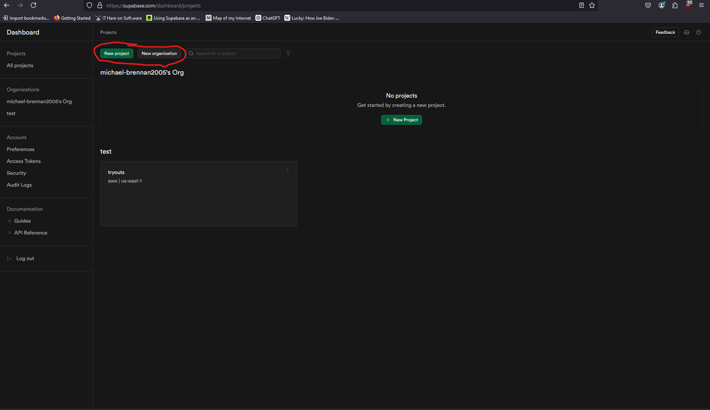
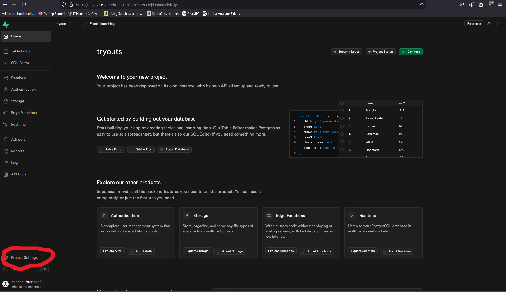
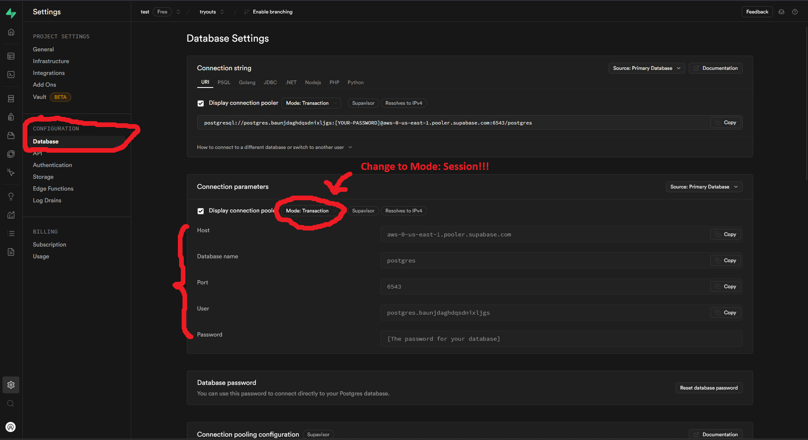

# Prerequisites

- [Git](https://git-scm.com/)
- [Golang](https://go.dev/)
  - Install through the official website, don't rely on package manager
- A [Supabase](https://supabase.com/) account
  - You can use your Github account for this
- [NodeJS](https://nodejs.org/en/)
- NOTE: This guide assumes that you are using Linux/MacOS. If you are using Windows, please install [WSL](https://learn.microsoft.com/en-us/windows/wsl/install).
- Clone the repository by running `git clone git@github.com:GenerateNU/3stones.git`.

# Frontend Setup

0. Install [ExpoGo](https://expo.dev/go) on your mobile device

1. Run `cd frontend` to change to the frontend directory.

2. Run `npx install yarn` to install the Yarn package manager.

3. Run `npx expo install` to install all packages used in the project.

4. Run `npx expo start --tunnel` to run the frontend!

# Backend setup

1. Create a `.env.dev` file for you to store your configuration and environment secrets. Run `cp .env.template .env.dev`.

2. Rather than worry about locally installing PostgreSQL, we'll use Supabase for provisoning our database instead. Log in to your Supabase account.

   1. First create a new organization. From the **Dashboard**, click **New organization**, give this new org a name, and leave the type of organization and pricing plan at its defaults. THen click **Create organization**.
   2. Next, create a new project. From the **Dashboard**, click **Create project**, Set the organization to the org you just created, give the project a name, and a database password (if not already generated). **SAVE THE DATABASE PASSWORD!!**. Leave the region at its default, and then click **Create new project**.
      
   3. Once you click create new project, it should automatically open you to the project page. If not, from the **Dashboard** click on the project you just created. It may be a few minutes for Supabase to fully set up your project.
   4. Once the project has been fully setup, hover over the sidebar on the left and click **Project Settings** on the bottom. Then navigate to the **Database** tab under the **Configuration** header.
      
   5. Here you should see a group of settings titled **Connection parameters**. Switch the **Mode** setting (where `Mode: Transaction` is set) to **Session mode**. Then, copy the parameters to the `.env.dev` file you crated earlier. The following is a list of which connection parameter maps to which env variable. - `Host` -> `TS3_DATABASE_HOST` - `Database name` -> `TS3_DATABASE_DBNAME` - `Port` -> `TS3_DATABASE_PORT` - `User` -> `TS3_DATABASE_USER` - `Password` -> `TS3_DATABASE_PASSWORD` - This will be the password you saved earlier.
      
   6. Supabase contains lots of features that can be useful when debugging and developing, such as its Table Editor, SQL Editor, and Schema Visualizer. Explore a little!

3. You should now have the necessary setup to run the project. Change into the backend directory by running `cd 3stones/backend`. Then run the backend with `go run main.go`.
